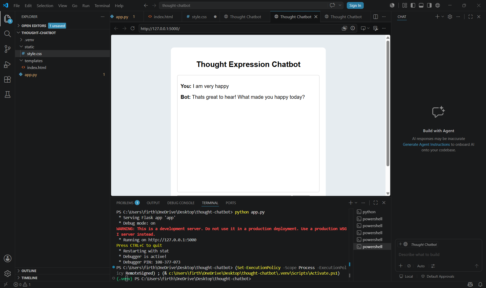

# Thought Expression Chatbot

A simple chatbot that allows users to express their thoughts and emotions through conversation.

## Features
- Emotion-based responses
- Interactive chat interface
- Simple and user-friendly design

## Technologies Used
- Python
- Flask
- HTML
- CSS
- JavaScript

## Screenshot

## GitHub Repository

[View Project Repository](https://github.com/firthous2307-blip/thought-expression-chatbot)

## Project Status
Currently Developing

## Developed By
Firthous
